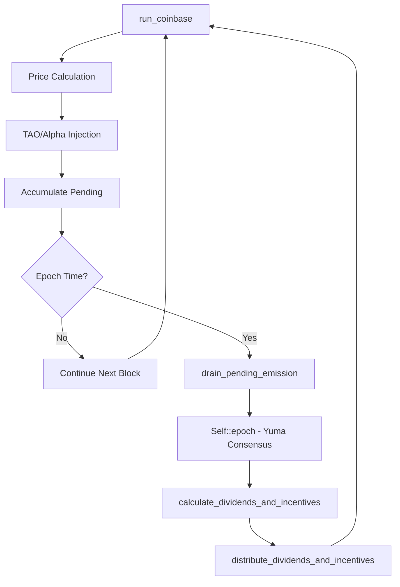

# Function Reference & Architecture Guide

This page explains how the core Yuma Consensus and emission functions work together, and provides a comprehensive reference for all key functions in the system.

## How run_epoch and run_coinbase Relate

A common source of confusion is understanding how `run_epoch.rs` and `run_coinbase.rs` work together despite neither file directly importing the other.

### The Architecture 

Both files are part of the **same Substrate pallet implementation**:

```rust
// In lib.rs
pub mod coinbase;  // Contains run_coinbase.rs  
pub mod epoch;     // Contains run_epoch.rs

// Both files use:
impl<T: Config> Pallet<T> {
    // Functions from both files become methods on the same struct
}
```

The `use super::*;` at the top of each file imports everything from the parent module, giving both files access to:
- The same `Pallet<T>` struct
- All storage items (shared blockchain state)
- All other modules in the pallet

### The Call Chain

```rust
// Every block: coinbase accumulates emissions
Self::run_coinbase(block_emission)

// Every tempo: coinbase calls epoch for consensus
if Self::should_run_epoch(netuid, current_block) {
    Self::drain_pending_emission(/* accumulated emissions */);
    // Inside drain_pending_emission:
    let hotkey_emission = Self::epoch(netuid, pending_alpha);
    //                    ^^^^^^^^^^^^
    //                    Calls function defined in run_epoch.rs!
}
```

### Timing Relationship

The architecture creates a **batch processing pattern**:

1. **Every Block (Fast)**: `run_coinbase()` injects liquidity and accumulates emissions
2. **Every Tempo (Slow)**: `epoch()` processes accumulated emissions through consensus

**Example**: If tempo = 360 blocks (~60 minutes):
- 359 blocks: Only coinbase runs, accumulating emissions
- 1 block: Coinbase triggers epoch, which processes all accumulated emissions

---

## Core Function Reference

### Epoch Functions (`run_epoch.rs`)

#### `epoch(netuid, rao_emission) -> Vec<(AccountId, AlphaCurrency, AlphaCurrency)>`
**Main Yuma Consensus Implementation**

Processes validator weights and distributes emissions through the complete [Yuma Consensus](../yuma-consensus.md) algorithm:

1. **Activity filtering** - Only recently active validators influence consensus
2. **Stake calculation** - Validator permit assignment based on top-k stake  
3. **Weight processing** - Consensus calculation with κ-clipping
4. **Miner ranking** - Aggregate rankings weighted by validator stake
5. **Bond formation** - EMA bond updates between validators and miners
6. **Emission distribution** - Final allocation to miners and validators

**Called by:** `drain_pending_emission()` in coinbase during epoch timing

---

#### `epoch_dense(netuid, rao_emission) -> Vec<(T::AccountId, AlphaCurrency, AlphaCurrency)>`
**Dense Matrix Version (Testing Only)**

Alternative implementation using dense matrices instead of sparse ones. Contains identical consensus logic but with different data structures for testing and validation purposes.

**Use Case:** Unit tests, consensus algorithm verification, debugging

---

### Configuration & Parameter Functions

#### `get_float_rho(netuid) -> I32F32`
**Bond EMA Parameter Retrieval**

Retrieves the rho parameter used in exponential moving average calculations for bond updates.

**Connection:** Implements the α parameter in bond EMA formula: `B_ij^(t) = α ΔB_ij + (1-α) B_ij^(t-1)`

---

#### `get_float_kappa(netuid) -> I32F32`
**Consensus Threshold Parameter**

Gets the consensus threshold κ (kappa) that determines what fraction of stake must agree for consensus.

**Default:** 0.5 (51% of stake must agree)  
**Related:** [Consensus clipping mechanism](../yuma-consensus.md#clipping)

---

#### `get_float_bonds_penalty(netuid) -> I32F32`
**Bond Penalty Factor**

Retrieves the penalty factor β applied when validator weights exceed consensus.

**Formula:** `W̃_ij = (1-β) W_ij + β W̄_ij`  
**Purpose:** [Penalizes out-of-consensus bonds](../yuma-consensus.md#penalizing-out-of-consensus-bonds)

---

### Data Retrieval Functions

#### `get_block_at_registration(netuid) -> Vec<u64>`
**Registration Block History**

Returns when each neuron was last registered, used to filter outdated weights.

**Usage:** Prevents validators from voting on miners that re-registered after the weight was set

---

#### `get_weights_sparse(netuid) -> Vec<Vec<(u16, I32F32)>>`
**Sparse Weight Matrix Retrieval**

Fetches the weight matrix W_ij in sparse format for memory efficiency.

**Format:** `Vec<validator_weights>` where `validator_weights = Vec<(miner_uid, weight)>`

---

#### `get_weights(netuid) -> Vec<Vec<I32F32>>`
**Dense Weight Matrix Retrieval**

Fetches the complete weight matrix as a dense n×n matrix.

**Usage:** Testing and small subnets where memory efficiency is less critical

---

#### `get_bonds_sparse(netuid) -> Vec<Vec<(u16, I32F32)>>`
**Sparse Bond Matrix Retrieval**

Gets the bond matrix B_ij in sparse format, representing validator-miner relationships.

**Connection:** [Bond mechanics](../yuma-consensus.md#bonding-mechanics) in Yuma Consensus

---

#### `get_bonds(netuid) -> Vec<Vec<I32F32>>`
**Dense Bond Matrix Retrieval**

Retrieves the complete bond matrix as a dense n×n matrix.

---

#### `get_bonds_fixed_proportion(netuid) -> Vec<Vec<I32F32>>`
**Proportional Bond Matrix**

Returns bonds normalized to fixed proportions (0-1 scale).

---

#### `get_bonds_sparse_fixed_proportion(netuid) -> Vec<Vec<(u16, I32F32)>>`
**Sparse Proportional Bonds**

Sparse version of proportional bond matrix.

---

### Bond Computation Functions

#### `compute_ema_bonds_normal_sparse(bonds_delta, bonds, netuid) -> Vec<Vec<(u16, I32F32)>>`
**Original Yuma Bond EMA (Sparse)**

Computes exponential moving average of bonds using a fixed α parameter for all validator-miner pairs.

**Algorithm:** Traditional EMA with single learning rate  
**Used When:** Liquid Alpha is disabled

---

#### `compute_ema_bonds_normal(bonds_delta, bonds, netuid) -> Vec<Vec<I32F32>>`
**Original Yuma Bond EMA (Dense)**

Dense matrix version of the original bond EMA calculation.

---

#### `compute_bonds(netuid, weights, bonds, consensus) -> Vec<Vec<I32F32>>`
**Liquid Alpha Bond Computation (Dense)**

Advanced bond calculation with consensus-based α parameters. Each validator-miner pair gets a unique EMA rate.

**Algorithm:** `α_ij = f(consensus_j, weight_ij, bond_ij)`  
**Used When:** Liquid Alpha is enabled (Yuma3)

---

#### `compute_bonds_sparse(netuid, weights, bonds, consensus) -> Vec<Vec<(u16, I32F32)>>`
**Liquid Alpha Bond Computation (Sparse)**

Sparse matrix version of the liquid alpha bond computation for better performance.

---

### Liquid Alpha Functions

#### `compute_liquid_alpha_values(netuid, weights, bonds, consensus) -> Vec<Vec<I32F32>>`
**Consensus-Based Alpha Matrix (Dense)**

Calculates individual α parameters for each validator-miner bond based on consensus alignment.

**Innovation:** Variable learning rates that adapt to consensus agreement

---

#### `compute_liquid_alpha_values_sparse(netuid, weights, bonds, consensus) -> Vec<Vec<I32F32>>`
**Consensus-Based Alpha Matrix (Sparse)**

Sparse version of the liquid alpha calculation, outputting dense alpha matrix.

---

#### `alpha_sigmoid(consensus, weight, bond, alpha_low, alpha_high, steepness) -> I32F32`
**Alpha Parameter Calculation**

Sigmoid function that determines EMA learning rate based on consensus deviation.

**Formula:** `α = α_low + sigmoid(deviation) × (α_high - α_low)`  
**Purpose:** Faster adaptation when validators diverge from consensus

---

#### `compute_disabled_liquid_alpha(netuid) -> I32F32`
**Fallback Alpha Calculation**

Computes traditional fixed α parameter when liquid alpha is disabled.

---

### Administrative Functions

#### `do_set_alpha_values(origin, netuid, alpha_low, alpha_high) -> DispatchResult`
**Alpha Parameter Configuration**

Allows subnet owners to configure liquid alpha parameters.

**Validation:** Ensures parameters are within acceptable ranges to prevent system instability

---

#### `do_reset_bonds(netuid, account_id) -> DispatchResult`
**Bond Reset Mechanism**

Resets bonds for a specific account, typically used during deregistration.

---

### Complete Coinbase Function Reference (`run_coinbase.rs`)

### Primary Emission Functions

#### `run_coinbase(block_emission: U96F32)`
**Core Emission Distribution Engine**

Main function that runs every block to implement the [injection phase](../emissions.md#injection) of the emission system.

**Process Flow:**
1. Calculate price-proportional TAO distribution across subnets
2. Inject TAO and alpha liquidity into AMM pools
3. Accumulate pending emissions for epoch distribution
4. Execute epochs when tempo timing is reached

**Related:** [Price-based distribution](../emissions.md#tao-reserve-injection), [alpha injection](../emissions.md#alpha-reserve-injection)

---

### Emission Calculation Functions

#### `calculate_dividends_and_incentives(netuid, hotkey_emission) -> (BTreeMap<T::AccountId, AlphaCurrency>, BTreeMap<T::AccountId, U96F32>)`
**Emission Type Separation**

Separates epoch results into miner incentives and validator dividends, handling child key delegation.

**Output:**
- Incentives: Direct miner rewards in alpha
- Dividends: Validator rewards (subject to take and delegation)

---

#### `calculate_dividend_distribution(pending_alpha, pending_tao, tao_weight, stake_map, dividends) -> (BTreeMap<T::AccountId, U96F32>, BTreeMap<T::AccountId, U96F32>)`
**Dividend Type Allocation**

Splits validator dividends between alpha (subnet-specific) and TAO (root) distributions based on stake composition.

**Algorithm:** Proportional split based on alpha vs. TAO stake holdings  
**Connection:** [Validator stake weight](../emissions.md#extraction) calculations

---

#### `calculate_dividend_and_incentive_distribution(netuid, pending_tao, pending_validator_alpha, hotkey_emission, tao_weight) -> (BTreeMap<T::AccountId, AlphaCurrency>, (BTreeMap<T::AccountId, U96F32>, BTreeMap<T::AccountId, U96F32>))`
**Comprehensive Distribution Calculation**

Orchestrates the complete emission distribution process combining incentives and dividend calculations.

---

### Distribution Functions

#### `distribute_dividends_and_incentives(netuid, owner_cut, incentives, alpha_dividends, tao_dividends)`
**Final Emission Distribution**

Executes the actual distribution of rewards to participants, applying takes and delegation rules.

**Process:**
1. Distribute subnet owner cut (configurable %, default 18%)
2. Distribute miner incentives (50% of total when miners active)
3. Apply validator take percentages
4. Distribute remaining rewards to stakers proportionally

---

#### `get_parent_child_dividends_distribution(hotkey, netuid, dividends) -> Vec<(T::AccountId, AlphaCurrency)>`
**Child Key Delegation Distribution**

Handles complex validator dividend distribution when child keys (delegation) are involved.

**Features:**
- Proportional distribution based on delegation amounts
- Validator take extraction before delegation
- Support for multi-level delegation hierarchies

---

### Utility Functions

#### `get_stake_map(netuid, hotkeys) -> BTreeMap<T::AccountId, (AlphaCurrency, AlphaCurrency)>`
**Stake Information Aggregation**

Collects alpha and TAO stake information for all provided hotkeys.

**Output:** `(alpha_stake, tao_stake)` pairs for dividend calculations

---

#### `get_self_contribution(hotkey, netuid) -> u64`
**Self-Stake Calculation**

Calculates how much stake a validator contributes themselves (vs. delegated stake).

**Usage:** Determines validator's share of their own emissions before delegation splits

---

### Epoch Timing Functions

#### `should_run_epoch(netuid, current_block) -> bool`
**Epoch Timing Check**

Determines if a subnet should run its epoch based on tempo scheduling.

**Formula:** `(block_number + netuid + 1) % (tempo + 1) == 0`  
**Connection:** [Tempo-based extraction](../emissions.md#extraction) timing

---

#### `blocks_until_next_epoch(netuid, tempo, block_number) -> u64`
**Epoch Countdown**

Calculates how many blocks remain until the next epoch for a subnet.

**Usage:** Monitoring and prediction of epoch timing

---

### Primary Orchestration Function

#### `drain_pending_emission(netuid, pending_alpha, pending_tao, pending_swapped, owner_cut)`
**Epoch Execution Orchestrator**

Coordinates the complete emission distribution process by:
1. Calling `epoch()` to run Yuma Consensus
2. Calculating emission splits (50%/50% miner/validator when miners active)
3. Processing delegation and takes
4. Distributing final rewards

**Critical Bridge:** Connects coinbase injection with epoch consensus and final distribution

---

### Timing Coordination Functions

#### `should_run_epoch(netuid, current_block) -> bool`
**Epoch Timing Logic**

**Formula**: `(block_number + netuid + 1) % (tempo + 1) == 0`

This staggered timing ensures:
- Different subnets run epochs at different blocks (load balancing)
- Predictable tempo-based scheduling
- Synchronized network behavior

---

## System Integration

### Data Flow Architecture



### Shared Storage

Both modules read/write the same blockchain storage:

- **`PendingEmission<NetUid>`**: Accumulated alpha for distribution
- **`Bonds<NetUid, u16>`**: Validator-miner EMA relationships  
- **`ValidatorPermit<NetUid>`**: Top-k stake validation rights
- **`Weights<NetUid, u16>`**: Validator rankings of miners

### Key Integration Points

1. **Temporal coordination**: Coinbase accumulates, epoch processes, distribution executes
2. **Economic consistency**: Mathematical formulas from docs implemented across both modules
3. **State synchronization**: Shared storage ensures consistent view of network state
4. **Performance optimization**: Sparse matrices for large subnets, batched processing

---

## Essential Function Categories

### Configuration & Parameters
- `get_float_kappa(netuid)` - Consensus threshold (default 51%)
- `get_float_bonds_penalty(netuid)` - Penalty factor for out-of-consensus weights
- `do_set_alpha_values()` - Configure liquid alpha parameters

### Data Retrieval  
- `get_weights_sparse(netuid)` - Validator weight matrix (memory efficient)
- `get_bonds_sparse(netuid)` - Validator-miner bond matrix
- `get_block_at_registration(netuid)` - Filter outdated weights

### Economic Distribution
- `calculate_dividends_and_incentives()` - Separate miner vs validator rewards
- `get_self_contribution()` - Calculate validator's own stake contribution
- `blocks_until_next_epoch()` - Timing prediction for monitoring

---

## Real-World Analogy

Think of the system like a **payroll company**:

- **Coinbase** = **Accounting Department**
  - Tracks company revenue daily (price calculations)
  - Allocates funds to divisions (subnet injection)
  - Accumulates amounts owed (pending emissions)

- **Epoch** = **HR Department**
  - Evaluates employee performance periodically (consensus)
  - Determines merit-based bonuses (miner incentives)
  - Calculates manager commissions (validator dividends)

Both departments work for the same company (Pallet), share the same database (Storage), but have different responsibilities and timing.

---

## Why This Architecture Matters

Understanding this relationship is crucial for:

- **Debugging**: Issues could originate in either injection or consensus phases
- **Development**: Features often need both accumulation and distribution logic  
- **Performance**: Timing affects network scalability and economic security
- **Economics**: Coordination between modules affects token incentive alignment

This architecture elegantly coordinates complex economic mechanisms while maintaining clean separation of concerns and code organization.

## Documentation Links

- **Conceptual**: [Yuma Consensus](../yuma-consensus.md) | [Emissions](../emissions.md) | [Staking](../staking-and-delegation/delegation.md)
- **Implementation**: [Epoch Details](./epoch.md) | [Coinbase Details](./emissions-coinbase.md) | [Swap Mechanics](./swap-stake.md)